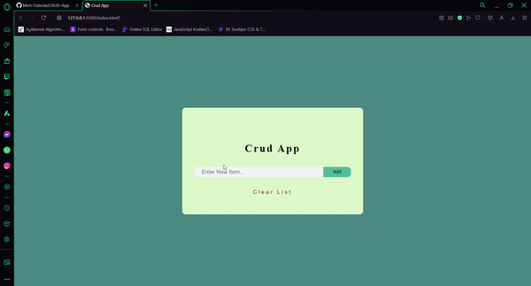

# ✏CRUD App📄
📰This project is a simple CRUD (Create, Read, Update, Delete) application developed using HTML, CSS, and JavaScript. The app allows users to add, edit, delete, and clear all items with ease. It provides a user-friendly interface to manage a list of items dynamically.📎

# 🗃Features📝
- **Add Item:** Add new items to the list and display them in the app.
- **Edit Item:** Edit existing items and save the changes.
- **Delete Item:** Remove a specific item from the list.
- **Clear All:** Clear all items from the list at once.
- **Local Storage Support:** Data is stored in localStorage, so items persist even after the page is reloaded.

# 🎉Preview📋

